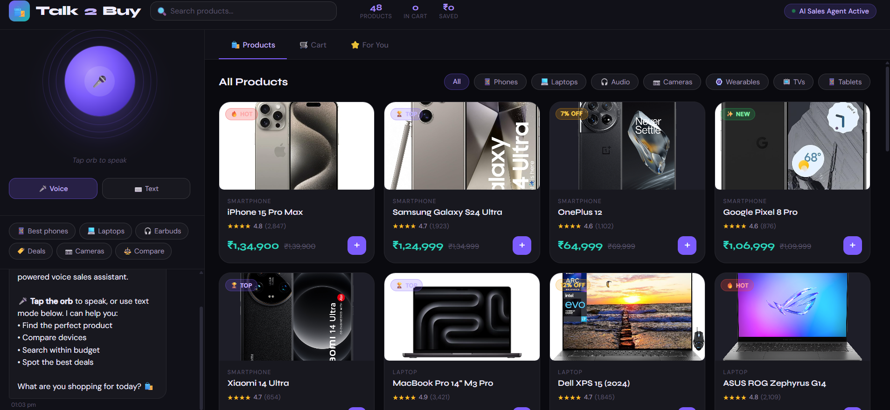
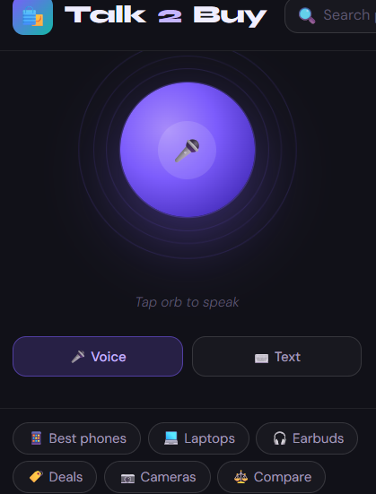
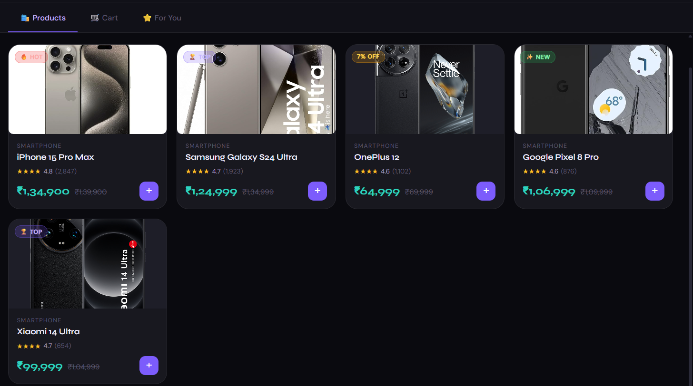
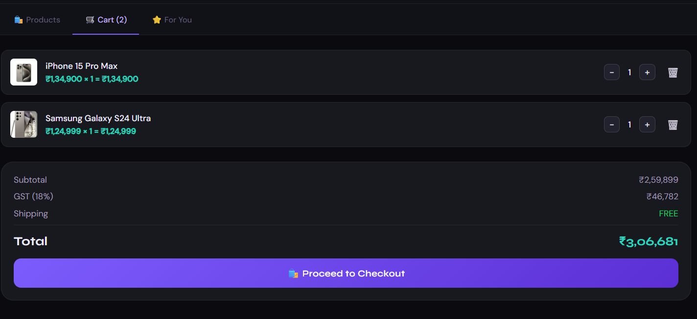
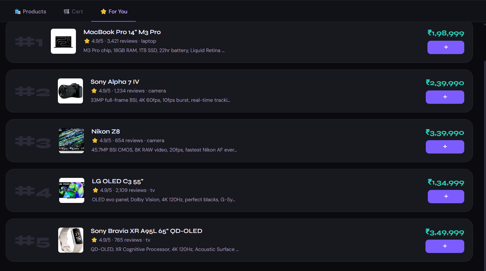
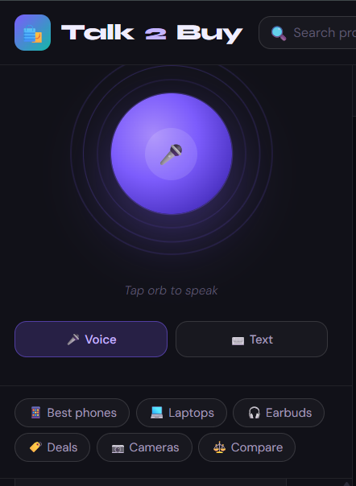
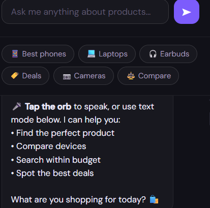

# 🛍️ Talk2Buy – AI Voice Sales Assistant

Talk2Buy is an intelligent AI-powered voice shopping assistant that transforms online shopping into a real-time conversational experience. Users can interact using voice or text to discover products, compare items, receive recommendations, and manage purchases seamlessly.

---

## 🚀 Features

- 🎤 Real-time Voice Recognition
- 💬 AI Conversational Shopping Assistant
- 📱 Smart Product Recommendations
- ⚖️ Product Comparison System
- 🛒 Interactive Shopping Cart
- 🔍 Product Search & Filtering
- 🎧 Voice Response using Speech Synthesis
- 📊 Dynamic Product Catalog
- 🌙 Modern Responsive UI
- ⚡ Fast Client-Side Performance

---

## 🖥️ Demo Preview

Talk2Buy allows users to:

- Search for products using voice commands
- Compare smartphones, laptops, headphones, and more
- Add items to cart instantly
- Receive AI-generated recommendations
- View deals and discounts
- Experience immersive conversational shopping

---

# 📸 Screenshots

## 🏠 Main Dashboard



---

## 🎤 Voice Assistant Interface



---

## 🛍️ Product Listing Page



---

## 🛒 Shopping Cart



---

## ⭐ AI Recommendations



---

## 💬 Smart Shopping Assistant



---

## 📱 Responsive Mobile Design



---

## 📂 Project Structure

```bash
Talk2Buy/
│
├── index.html              # Main application file
├── README.md               # Project documentation
│
├── screenshots/
│   ├── 1.png
│   ├── 2.png
│   ├── 4.png
│   ├── 5.png
│   ├── 7.png
│   ├── 3.png
│   └── 6.png
│
├── css/
├── js/
└── data/
```

---

## 🛠️ Technologies Used

- HTML5
- CSS3
- JavaScript
- Web Speech API
- Speech Synthesis API

---

## 🎤 Voice Features

### Speech Recognition
Talk2Buy uses the browser's built-in Web Speech API for:
- Voice input detection
- Real-time transcription
- Natural language shopping queries

### Speech Synthesis
The AI assistant responds with:
- Human-like voice output
- Conversational shopping guidance
- Product recommendations

---

## 📱 Supported Categories

- Smartphones
- Laptops
- Earbuds
- Cameras
- Smartwatches
- TVs
- Tablets

---

## ⚡ How to Run

### 1️⃣ Clone Repository

```bash
git clone https://github.com/Viswanth2006/Talk2Buy.git
```

### 2️⃣ Open Project

Open `index.html` in your browser.

---

## 🌐 Browser Support

| Browser | Support |
|----------|----------|
| Chrome   | ✅ |
| Edge     | ✅ |
| Brave    | ✅ |

---

## 🔥 Future Enhancements

- AI Recommendation Engine
- Backend Integration
- User Authentication
- Payment Gateway
- Database Support
- Multi-language Voice AI
- Real-time Product APIs

---

## 🤝 Contributing

Contributions are welcome!

1. Fork the repository
2. Create your feature branch
3. Commit your changes
4. Push to your branch
5. Open a Pull Request

---

## 📜 License

This project is licensed under the MIT License.

---

## 👨‍💻 Developer

Developed with ❤️ by Viswanth Sana

---

## ⭐ Support

If you like this project:
- Give it a ⭐ on GitHub
- Share it with friends
- Contribute improvements

---
